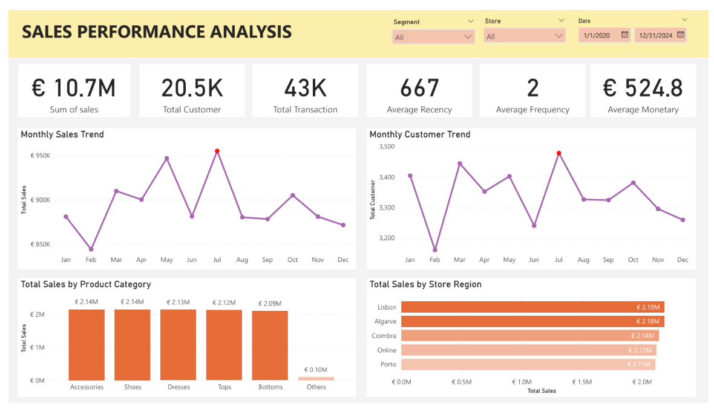
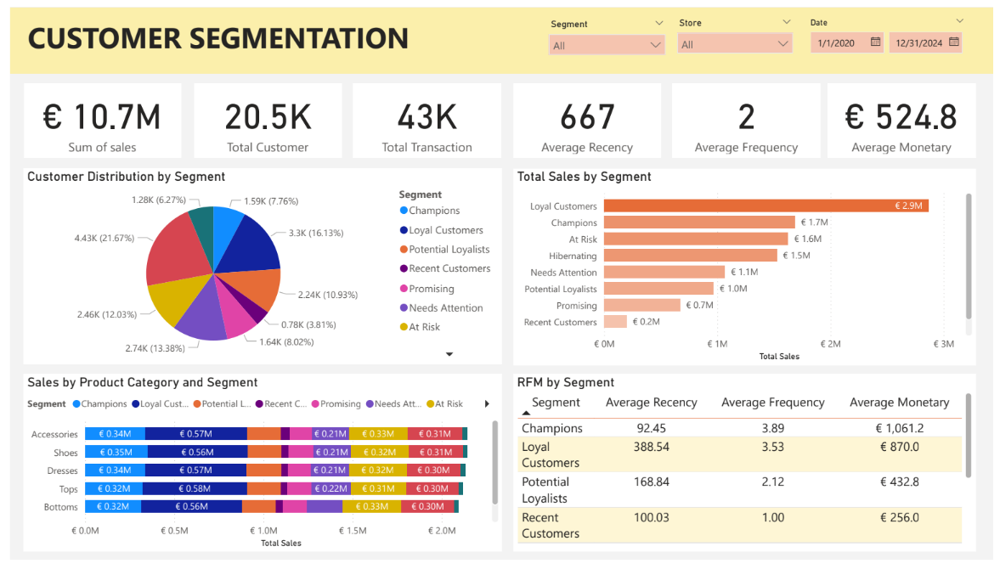
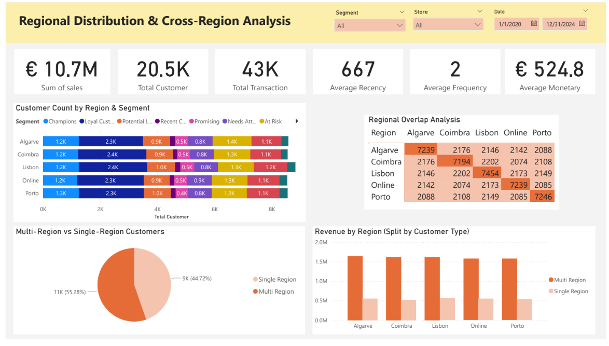

# Retail Customer Segmentation & Sales Performance Dashboard (Power BI)

This project is a comprehensive customer analytics dashboard built using **Power BI**, focusing on overall sales performance, **RFM-based customer segmentation**, and **regional cross-shopping behavior**. The goal is to identify valuable customers, understand purchasing patterns, and support data-driven marketing and strategic decisions.

Dataset source (Kaggle):  
[link](https://www.kaggle.com/datasets/vanpatangan/retail-fashion-data)

---

## 📌 Dataset Overview

The dataset includes:

- 50,000+ retail transactions  
- 20,000+ unique customers  
- 5 store locations: Lisbon, Algarve, Coimbra, Porto, Online  
- 6 product categories  
- Historical period: **2020–2024**

---

## 🧹 Data Preprocessing

### **Data Cleaning**
- Removed duplicate rows  
- Filled missing discount values with 0  
- Standardized text fields for consistency  
- Removed rows with invalid or incomplete values  

### **Feature Engineering**
- Created `Sales = Quantity × Price`  
- Created `Profit` column  
- Converted date formats  
- Built RFM components:
  - Recency  
  - Frequency  
  - Monetary  

### **Data Modeling**
- Joined Sales, Customer, Product, and Store tables  
- Ensured correct relationships for Power BI star schema  

---

# 📊 Dashboard Structure

The dashboard consists of **three main pages**:

1. **Sales Performance Analysis**  
2. **Customer RFM Segmentation**  
3. **Regional Distribution & Cross-Region Analysis**

---

# 1️⃣ Sales Performance Analysis

### **Highlights**
- Total Sales: €10.7M  
- Total Customer: 20.5K  
- Total Transaction: 43K  
- Average Recency: 667 days  
- Average Frequency: 2  
- Average Monetary: €524.8  

### **Visuals**
- Monthly Sales Trend  
- Monthly Customer Trend  
- Sales by Product Category  
- Sales by Store Region  

This page helps identify sales trends, customer activity, and category/region performance.

---

# 2️⃣ Customer RFM Segmentation

This page categorizes customers into RFM-based segments:

- Champions  
- Loyal Customers  
- Potential Loyalists  
- Promising  
- Recent Customers  
- Needs Attention  
- At Risk  
- Hibernating  

### **Visuals**
- Distribution of customers by segment  
- Sales by segment  
- Sales by product category & segment  
- RFM metric table (Avg Recency, Frequency, Monetary)

---

# 3️⃣ Regional Distribution & Cross-Region Analysis

### **Visuals**
- Customer count by region & segment  
- Regional Overlap Matrix  
- Multi-region vs Single-region customer distribution  
- Revenue by region (customer type split)

### **Insights**
- Multi-region shoppers = 55% of customers  
- They generate ~3× more revenue than single-region shoppers  
- Lisbon & Algarve are the best-performing regions  

---

## 📁 Files Included

- `dashboard.pbix` — Power BI dashboard  
- `dashboard.pdf` — Dashboard export
- `Data_Cleaning_CS.ipynb` — Data Preprocessing 
- `asset/` — Screenshot folder  
- README.md — Project documentation  

---

## 🎯 Conclusion

This dashboard delivers meaningful insights into customer behavior, segmentation, and regional patterns. It supports decision-making in:

- Customer retention  
- Targeted marketing  
- Regional strategy  
- Product optimization  

---

## ⭐ About the Project

Created to improve skills in:

- Power BI  
- DAX  
- Data Modeling  
- RFM Segmentation  
- Business Analytics  
- Data Visualization

---
